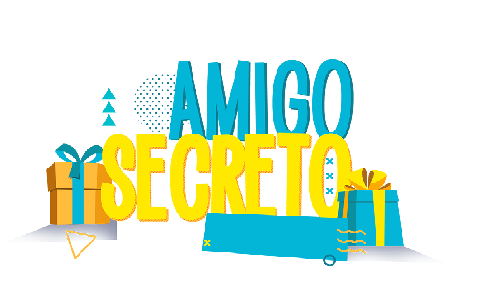

<h1 align="center">Jogo do Amigo Secreto</h1> 
  
 
 <!-- 
Badges -->     

Índice
Descrição do Projeto
Status do Projeto
Funcionalidades e Demonstração da Aplicação
Acesso ao Projeto
Tecnologias Utilizadas
Pessoas Contribuidoras
Pessoas Desenvolvedoras do Projeto
Licença

Descrição do Projeto
O Jogo do Amigo Secreto é uma aplicação web interativa desenvolvida para organizar sorteios de amigo secreto de forma simples, anônima e divertida.
O projeto permite:

Adicionar participantes a uma lista.
Confirmar a lista de participantes.
Realizar sorteios onde o sorteio é mantido em sigilo, revelado somente quando o usuário opta por visualizar o resultado.
Impedir que um mesmo participante sorteie mais de uma vez.

Status do Projeto
<h4 align="center"> 🚀 Projeto Finalizado 🚀 </h4>

Funcionalidades e Demonstração da Aplicação

Adicionar Participantes: Permite inserir nomes e exibir uma lista dos participantes.
Confirmação da Lista: Bloqueia os nomes adicionados e permite selecionar quem realizará o sorteio.
Sorteio Anônimo: O sorteio é realizado de forma sigilosa e o resultado só é revelado mediante ação do usuário.
Validações e Prevenções: Impede sorteios duplicados e exibe alertas quando não há mais participantes disponíveis.
Reset do Jogo: Opção para limpar toda a lista e reiniciar o sorteio.
Demonstração:
Você pode visualizar o funcionamento do sistema através dos GIFs/imagens incluídos no repositório ou executando localmente.

Acesso ao Projeto
Você pode acessar o código fonte e clonar o repositório usando o Git:

git clone https://github.com/KewinShamir/Jogo-do-Amigo-Secreto.git

Depois de clonado, abra o arquivo index.html no seu navegador para rodar a aplicação.

Tecnologias Utilizadas
HTML5
CSS3
JavaScript

Pessoas Desenvolvedoras do Projeto
 Kewin Shamir
Kewin Shamir
Obs.: Substitua "SEUID" pelo seu número de usuário do GitHub, se desejar exibir sua foto corretamente.

Licença
Este projeto está licenciado sob a MIT License.

Participe, contribua e divirta-se com o Jogo do Amigo Secreto!
